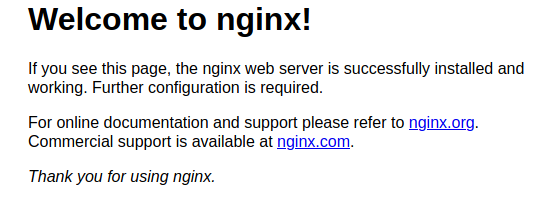
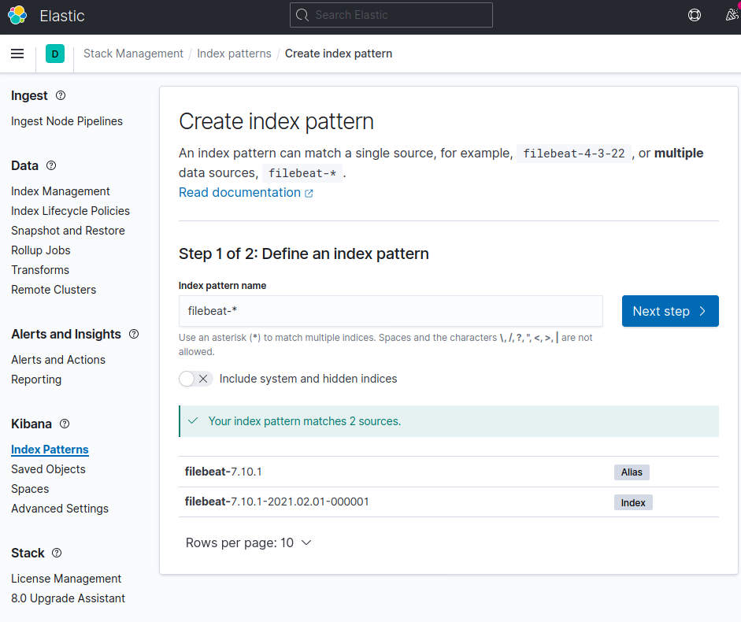
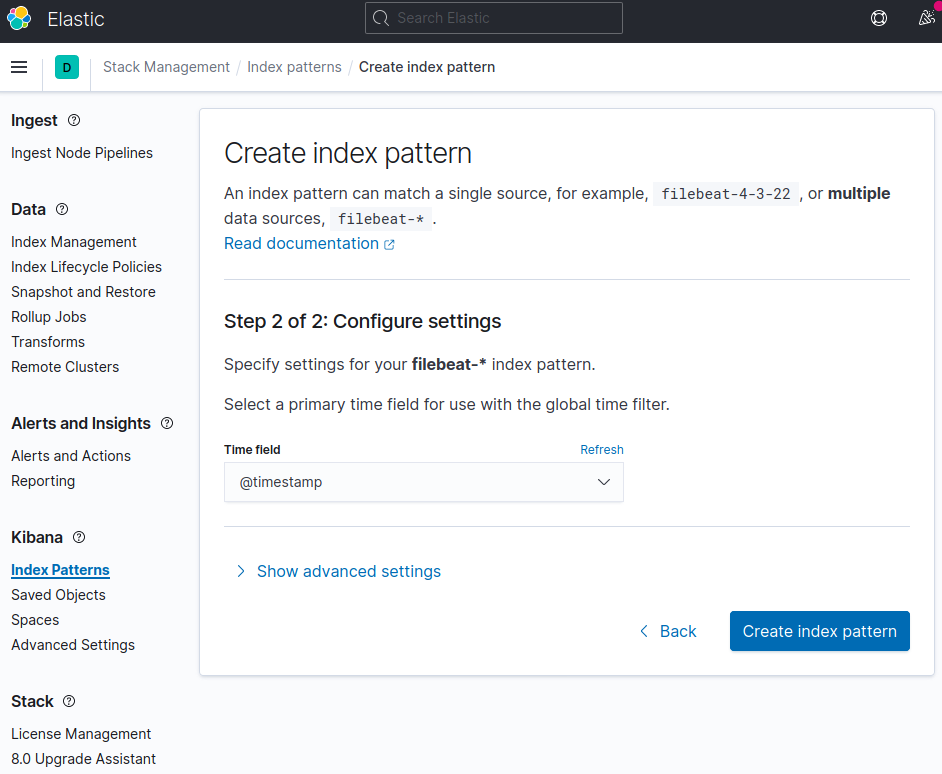
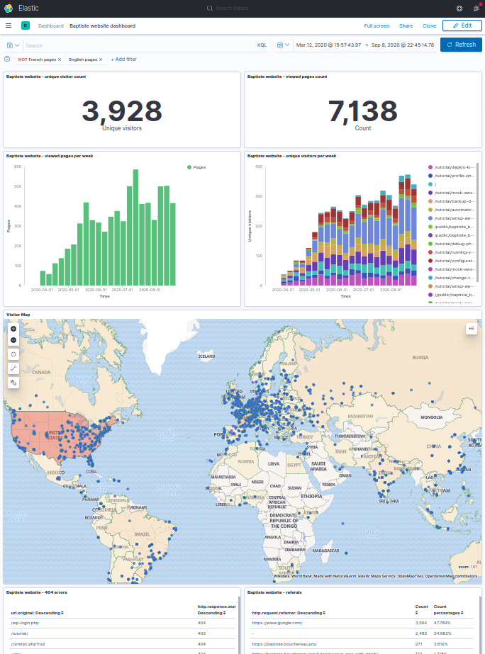

Run kibana and elasticsearch, sending data coming from nginx logs
=================================================================

Setup
-----

1. Run

```bash
git clone https://github.com/Ovski4/tutorials.git
cd docker-elk
```

2. Create the data volume with the right permissions:

```bash
docker-compose -f docker-compose-full-stack.yml run elasticsearch chown elasticsearch -R /usr/share/elasticsearch/data
```

3. Launch all containers:

```bash
docker-compose -f docker-compose-full-stack.yml up -d
```

4. Browse `http://localhost:5601/`. You might have to wait a few minutes while Kibana set things up. You can then click on '**Explore on my own**'.

5. Then browse `http://localhost:8085/`. You should see this page :



The http request will trigger some logs to be send to elasticsearch.

6. Come back to kibana at `http://localhost:5601/`. In the left panel, click on **Discover** under the **Kibana section** and create a new **index pattern**. You should see the filebeat index appearing in the select box. In the **Index pattern name** text field, type **filebeat-***



7. In the following page, select `@timestamp` and click `Create index pattern`.



Go to the discover page at `http://localhost:5601/app/discover#/`.

That's it, you should see some data. You might have to update the dates filter located on the top right of the page if nothing shows up.

You can now create visualizations with Kibana.

> Follow the next instructions to have a look at a kibana dashboard and some visualizations.

Run kibana and elasticsearch with existing data
===============================================

This quick setup can be very useful as a sandbox. It comes with data fetched from my personal blog.

Setup
-----

Stop the containers from the first part if needed :

```bash
docker-compose -f docker-compose-full-stack.yml down
```

Extract the data in the volume to bind:

```bash
unzip data-sandbox.zip -d ./elasticsearch/
```

Launch the containers:

```bash
docker-compose -f docker-compose-sandbox.yml up -d
```

Browse `http://localhost:5601/`, have look at the dashboard at `http://localhost:5601/app/kibana#/dashboards`.


