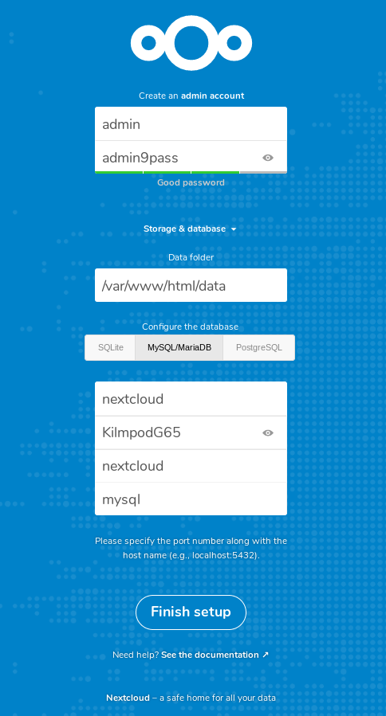

Backup your docker volumes with borg
====================================

[Detailed tutorial here.](https://baptiste.bouchereau.pro/tutorial/backup-docker-volumes-with-borg/)

These instructions assume you are testing things up and running everything from a single machine running on ubuntu bionic. If not you will likely need to adapt them.

Usage
-----

1. Run

```bash
git clone https://github.com/Ovski4/tutorials.git
cd docker-volume-borg-backup
```

2. Update the SSH_CONNECTION, BORG_REPO_PATH and SSH_KNOWN_HOSTS environment variables in the **docker-compose.yml** file according to your needs
3. Make sure the borg repo path exists: `mkdir /home/your_user/borg_repositories`
4. [Install borg backup](https://borgbackup.readthedocs.io/en/stable/installation.html#installation)
5. Setup the SSH keys

```bash
sudo apt install openssh-server
touch ~/.ssh/authorized_keys
ssh-keygen -f ~/.ssh/id_rsa_borg_backup -t rsa -N ''
cat ~/.ssh/id_rsa_borg_backup > secret_backup_server_user_private_key.txt
chmod 400 secret_backup_server_user_private_key.txt
cat ~/.ssh/id_rsa_borg_backup.pub >> ~/.ssh/authorized_keys
chmod g-w ~
chmod 700 ~/.ssh
chmod 600 ~/.ssh/authorized_keys
```

6. Run `docker-compose up -d`. Wait for the mysql container to be initialized. You can do so by running `docker-compose logs -f mysql`. If you can see "MySQL init process done. Ready for start up" you are good to go. Browse [http://localhost:8042/](http://localhost:8042/) then fill in the form like on this picture:



Hit **finish setup** and be patient. You should have Nextcloud running in a few minutes.

7. Run `docker-compose logs -f backup_cron`.

Every 5 minutes, you should see the following output:

```
backup_cron_1  | === I'm alive ===
```

To avoid waiting until 1AM to check if the backup runs smoothly update the **docker-compose.yml** file by adding the command like this:

```yaml
services:
  ...
  backup_cron:
    image: ovski/borgbackup-cron:v1.0.0
    ...
    command: /var/backup_script.sh
```

8. Run `docker-compose up -d` and `docker-compose logs -f backup_cron` again. Wait for the script to end and the container to stop. You should eventually have a backup available.

9. Let's check it out:

```bash
cd /home/your_user/borg_repositories
borg list nextcloud
```

Enter your passphrase (`mysuperpassphrasefortheborgnextcloudrepo`). You should see the list of backups.