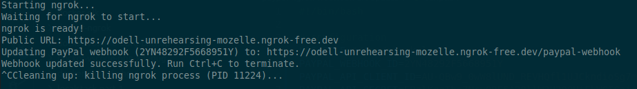
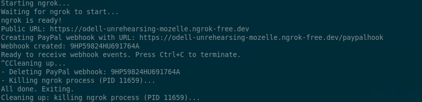

Automate PayPal webhook updates with ngrok for local development
================================================================

[Detailed tutorial here.](https://baptiste.bouchereau.pro/tutorial/automate-paypal-webhook-updates-ngrok-local-development/)

`paypal-webhook-update.sh` is a shell script that automates the following workflow:
* Manually starting ngrok
* Copying the forwarded URL
* Logging into the PayPal dashboard
* Editing and saving the webhook target

It:
* Starts ngrok
* Waits until the tunnel is ready
* Retrieves the public URL from the ngrok local API
* Updates the webhook via the PayPal API.
* Kill the ngrok process when the script terminates



`paypal-webhook-create.sh` is a shell script that automates the following workflow:
* Manually starting ngrok
* Copying the forwarded URL
* Logging into the PayPal dashboard
* Creating / deleting a new webhook via the PayPal API

It:
* Starts ngrok
* Waits until the tunnel is ready
* Retrieves the public URL from the ngrok local API
* Creates the webhook via the PayPal API.
* Kill the ngrok process and deletes the webhook when the script terminates



This way events are forwarded to the local machine without any manual work required.

Setup
-----

* Instal `jq` and `ngrok`. `curl` should also be installed.
* Make sure you authenticate with ngrok first by running `ngrok config add-authtoken <token>`

Run

```bash
git clone https://github.com/Ovski4/tutorials.git
cd paypal-ngrok-webhook-url-update
```

Edit the script variable values according to your needs. Retrieve the credentials at https://developer.paypal.com/dashboard/.

```bash
LOG_FILE="/tmp/ngrok.log"
PAYPAL_API_CLIENT_ID=xxxx
PAYPAL_API_SECRET=xxxx
PAYPAL_WEBHOOK_ID=xxxx
APP_PAYPAL_WEBHOOK_PATH='/paypal-webhook'
APP_DOMAIN=my-application.local
```

Then execute it:

```bash
chmod +x screenshot-paypal-webhook-update-script.sh
./screenshot-paypal-webhook-update-script.sh
```

Run Ctrl+C to terminate.


